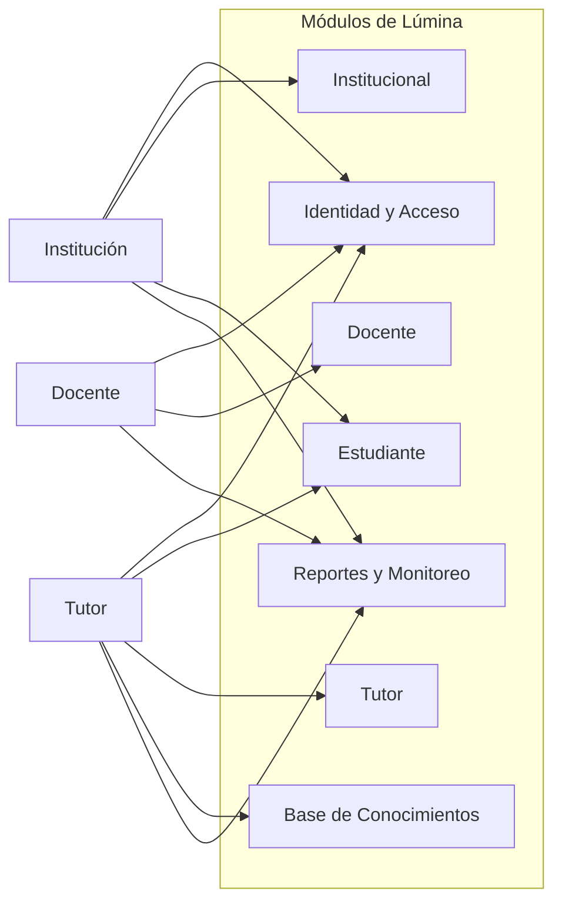
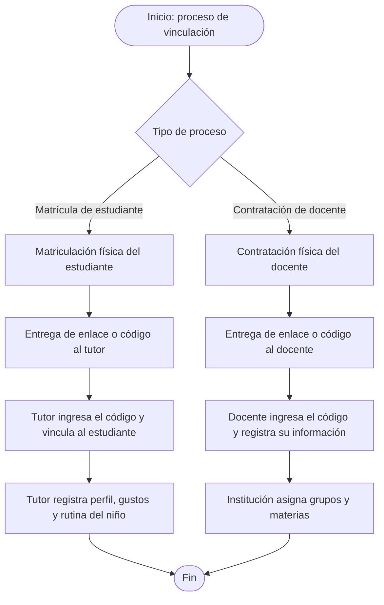

<div align="center">
  

  <h1>Lúmina</h1>
  <h3><i>Seguimiento educativo colaborativo para estudiantes con TEA.</i></h3>

  [](https://dotnet.microsoft.com/)
  [](https://www.microsoft.com/sql-server)
  [](https://jwt.io/)
  [](https://swagger.io/)
  [](https://developer.mozilla.org/)
</div>

---

## Tabla de Contenidos

1. [Descripción General del Proyecto](#1-descripción-general-del-proyecto)
2. [Requisitos Técnicos](#2-requisitos-técnicos)
3. [Arquitectura del Software](#3-arquitectura-del-software)
4. [Diseño del Sistema](#4-diseño-del-sistema)
5. [Base de Datos](#5-base-de-datos)
6. [Código Fuente](#6-código-fuente)
7. [Instalación y Configuración](#7-instalación-y-configuración)
8. [Manual de Despliegue](#8-manual-de-despliegue)
9. [Equipo](#9-equipo)

---

## 1. Descripción General del Proyecto

**Lúmina** es una aplicación web/móvil que gestiona el seguimiento de clases y asignaciones mediante la colaboración entre **Institución**, **Docente** y **Tutor**, orientada a estudiantes diagnosticados con **Trastorno del Espectro Autista (TEA)**.

Proyecto desarrollado para **Hackathon Nicaragua KronoX 2026** (10ª edición, INATEC), categoría **Aficionado**. Esta entrega corresponde a la **Fase Prototipo**, que cubre los 27 módulos/tablas mínimos necesarios para demostrar el flujo completo: **Institución → Docente → Tutor → Progreso del estudiante**.

### Problema que resuelve

El acompañamiento educativo de un estudiante con TEA requiere comunicación cercana y constante entre la institución, el docente y el tutor. Sin una herramienta estructurada, el tutor desconoce qué se trabaja en clase, el docente no conoce los gustos y rutinas del estudiante para adaptar su enseñanza, y la institución no puede monitorear el progreso de forma uniforme. Lúmina centraliza esta información para que cada actor cumpla su rol con visibilidad y trazabilidad.

### Funcionalidades principales

**Para la Institución**
- Matrícula de estudiantes y designación de grupos (cuota máxima de 10 estudiantes por grupo)
- Definición de periodos educativos y asignación de materias
- Alta y baja de docentes, emisión de códigos de vinculación
- Gestión de recursos de autorregulación y generación de reportes

**Para el Docente**
- Vinculación mediante código de contratación
- Planificación de contenidos, encuentros y clases por materia
- Diseño de material didáctico tipo PECS (tableros y tarjetas)
- Creación de variaciones de clase según gustos del estudiante
- Rutinas propias de la materia y sugerencias hacia el tutor

**Para el Tutor**
- Vinculación del estudiante mediante código de matrícula
- Registro del perfil, gustos/reforzadores y rutina cotidiana del niño
- Seguimiento de clases, asignaciones y material de estudio
- Consulta a la base de conocimientos (TEA, materias, estrategias)

### Estado actual del proyecto

Lúmina se está entregando por fases. Para este **primer entregable**, el **Frontend funciona de forma standalone**, con una base de datos simulada en `localStorage` del navegador — no depende del Backend para poder probarse. En paralelo, el equipo de Backend avanza en la API real (.NET 8 + SQL Server, ver secciones 3 a 5), que se irá conectando al Frontend en los siguientes entregables, reemplazando `localStorage` por las llamadas a la API.

| Componente | Estado en este entregable |
|---|---|
| Frontend (HTML/CSS/JS + `localStorage`) | ✅ Funcional de forma independiente |
| Backend (.NET 8 + SQL Server) | 🔄 En desarrollo, aún no integrado al Frontend |
| Integración Frontend ↔ Backend | ⬜ Planificada para el siguiente entregable |

---

## 2. Requisitos Técnicos

### Entorno de desarrollo

| Herramienta | Versión mínima | Enlace |
|---|---|---|
| .NET SDK | 8.0 | https://dotnet.microsoft.com/download/dotnet/8.0 |
| SQL Server | 2016+ (o Azure SQL) | https://www.microsoft.com/sql-server |
| SQL Server Management Studio / Azure Data Studio | — | https://learn.microsoft.com/sql/ssms/ |
| Visual Studio 2022 | 17.x | https://visualstudio.microsoft.com/ |
| Git | 2.x | https://git-scm.com/ |
| Extensión Live Server (VS Code) | — | para levantar el Frontend |

### Dependencias del Backend (NuGet)

| Paquete | Versión | Propósito |
|---|---|---|
| Microsoft.Data.SqlClient | 7.0.2 | Acceso a datos con SQL Server (ADO.NET) |
| Microsoft.AspNetCore.Authentication.JwtBearer | 8.0.22 | Autenticación JWT |
| BCrypt.Net-Next | 4.2.0 | Hash de contraseñas |
| Swashbuckle.AspNetCore | 6.6.2 | Documentación Swagger / OpenAPI |
| Microsoft.Extensions.Configuration.Abstractions | 10.0.11 | Lectura de configuración (appsettings) |

> A diferencia de otros stacks .NET, Lúmina **no usa un ORM** (ni Entity Framework ni Dapper): el acceso a datos es ADO.NET puro contra **stored procedures**, definido capa por capa en `DataAccess`.

### Requisitos de infraestructura

- Instancia de SQL Server accesible (local o Azure SQL) para ejecutar los scripts del Prototipo
- Navegador moderno para el Frontend
- No requiere Docker ni servicios en la nube en esta fase (ver [Manual de Despliegue](#8-manual-de-despliegue) para el estado actual y planes futuros)

---

## 3. Arquitectura del Software

El Backend sigue una **arquitectura en capas** (layered architecture) clásica de 4 proyectos .NET, sin ORM ni patrón CQRS: cada capa depende únicamente de la inmediatamente inferior.

### Diagrama de capas

```
┌─────────────────────────────────────────────────────────┐
│                         API                              │
│     Controllers · Program.cs · appsettings · Swagger     │
└────────────────────────┬────────────────────────────────┘
                         │ depende de
┌────────────────────────▼────────────────────────────────┐
│                       Business                           │
│      Services · Interfaces · DTOs (lógica de negocio)    │
└──────────┬──────────────────────────┬───────────────────┘
           │ depende de               │ es implementada por
┌──────────▼──────────┐   ┌──────────▼───────────────────┐
│         Core         │   │        DataAccess             │
│  Entities · Common   │   │  Repositories · ADO.NET +     │
│  (ServiceResponse,   │   │  Stored Procedures (SQL Srv)  │
│   RepositoryResponse,│   │                                │
│   MessageCodes)      │   │                                │
└─────────────────────┘   └──────────────────────────────┘
```

### Capas y responsabilidades

**Core** — Núcleo del sistema, sin dependencias externas. Contiene las entidades de dominio (`Student`, `Teacher`, `Subject`, `Module`, etc.) y los tipos de respuesta comunes (`RepositoryResponse<T>`, `ServiceResponse<T>`, `MessageCodes`, `PagedResponse<T>`, `PaginationParams`).

**DataAccess** — Implementa el acceso a datos: cada repositorio (`SubjectRepository`, `ModuleRepository`, `StudentRepository`, ...) abre una `SqlConnection`, invoca un stored procedure con `SqlCommand`, mapea el `SqlDataReader` a la entidad de `Core`, y captura `SqlException` traduciéndola a un código de error propio.

**Business** — Orquesta la lógica de negocio: cada `Service` recibe su `Repository` por inyección de dependencias, traduce los códigos de retorno del stored procedure (`OperationStatusCode`) a un `MessageCodes` semántico (`Success`, `NotFound`, `ErrorValidation`, `ErrorDataBase`, `NoData`, `Conflict`), y valida reglas de negocio (por ejemplo, que un `SubjectId` o `GroupId` referenciado exista).

**API** — Capa de entrada: `Controllers` REST que reciben `DTOs`, invocan el `Service` correspondiente, y traducen el `ServiceResponse` a códigos HTTP (`200`, `400`, `404`, `500`) con un cuerpo `UnsuccessfulResponseDto` uniforme en los casos de error. `Program.cs` configura JWT Bearer, CORS, Swagger e inyección de dependencias.

### Autenticación y autorización

- **JWT Bearer**: token firmado, generado en el login (`AuthController`), validado en cada endpoint protegido
- **Contraseñas**: hasheadas con **BCrypt**, nunca en texto plano
- **RBAC simple**: la tabla `Role` se asocia al `User` a través de `UserRole` (N:M); autorización por atributo `[Authorize(Roles = "...")]` sobre cada controlador, con los roles **INSTITUTION**, **TEACHER**, **GUARDIAN**
- **Vinculación por código**: `LinkCode` emite códigos de un solo uso (`PENDING → USED | EXPIRED | REVOKED`) para que Docentes y Tutores activen su cuenta, ya que el alta física (contratación/matrícula) ocurre fuera del sistema

---

## 4. Diseño del Sistema

### Módulos funcionales

| Módulo | Controller | Estado |
|---|---|---|
| Autenticación | `AuthController` | ✅ Implementado |
| Vinculación | `LinkCodeController` | ✅ Implementado |
| Roles | `RolesController` | ✅ Implementado |
| Materias | `SubjectController` | ✅ Implementado |
| Módulos de contenido | `ModulesController` | ✅ Implementado |
| Estudiantes | `StudentsController` | ✅ Implementado (CRUD completo) |
| Docentes, Tutores, Grupos, Planificación, PECS, Rutinas, Progreso, Base de Conocimientos | — | ⬜ Planificado (ver `Lumina_Roadmap_Entidades.md`) |

El repositorio base (acceso a datos) para el resto de las 27 entidades del Prototipo ya existe; la capa de negocio y los controladores se están completando siguiendo siempre el mismo patrón de 4 capas descrito en la sección anterior.

### Diagrama de caso de uso de contexto



### Flujo de vinculación (matrícula y contratación)



### Flujo de autenticación

```
POST /api/auth/login
│  → Busca usuario por email (USP_GetUserByEmail)
│  → Verifica hash BCrypt de la contraseña
│  → Genera JWT con los roles del usuario
│  → Retorna token
```

---

## 5. Base de Datos

**Motor actual:** SQL Server 2016+ / Azure SQL
**Acceso a datos:** ADO.NET puro (`Microsoft.Data.SqlClient`) contra **stored procedures**, sin ORM
**Alcance de esta fase:** 27 tablas (Fase Prototipo), documentadas en detalle en [`Database/README.md`](Database/README.md)

### Convenciones del modelo

- Nombres en inglés: `PascalCase` para tablas, `camelCase` para columnas
- Clave primaria siempre `id` (`IDENTITY(1,1)`); claves foráneas siempre `<referencia>Id`
- Auditoría con `createdAt` (obligatorio) y `updatedAt` (gestionado por la aplicación)
- **Borrado lógico** en lugar de físico: la mayoría de entidades usan `isActive` / `entityStatus` en vez de `DELETE`

### Agrupación de las 27 tablas por módulo

| Módulo | Tablas | Cantidad |
|---|---|---|
| Seguridad | `User`, `Role`, `UserRole`, `LinkCode` | 4 |
| Catálogos y entidades | `Teacher`, `Guardian`, `Student`, `EntityStudentRelation` | 4 |
| Perfil del estudiante | `StudentInterest` | 1 |
| Base de Conocimientos | `Keyword` | 1 |
| Administración | `Subject`, `ClassGroup`, `GroupSubject` | 3 |
| Planificación | `Module`, `Lesson`, `LessonStep`, `LearningContent`, `ContentKeyword`, `PecsBoard`, `PecsCard` | 7 |
| Monitoreo | `StudentProgress`, `StudyHistory`, `StudentHabit`, `Routine`, `HabitCompliance`, `RoutineDetail`, `RoutineLog` | 7 |
| **Total** | | **27** |

### Relaciones principales (alto nivel)

```
User ──< UserRole >── Role                  (N:M cuenta ↔ rol)
User ──< Teacher / Guardian / Student        (entidades con cuenta opcional)
ClassGroup ──< Student                       (1:N grupo → estudiantes)
ClassGroup ──< GroupSubject >── Subject      (asignación docente+materia al grupo)
             └── Teacher
Student ──< EntityStudentRelation >── (entityType)   (polimórfica tutor/docente)
Student ──< StudentInterest                   (gustos: N registros por estudiante)
Student ──< PecsBoard ──< PecsCard            (tableros PECS)
Student ──< StudentProgress                   (1:1)
Student ──< StudentHabit ──< HabitCompliance  (hábitos tranquilizadores)
Student ──< Routine ──< RoutineDetail ──< RoutineLog
Subject  ──< Module ──< Lesson ──< LessonStep
Lesson  ──< LearningContent ──< ContentKeyword >── Keyword
```

> El detalle campo por campo de cada tabla, el orden de creación por dependencias FK y el seed de datos demo se documentan en [`Database/README.md`](Database/README.md).

### Planes futuros — Migración a MySQL

El equipo ya cuenta con un script equivalente para **MySQL 8.0+** (`Database/LUMINA_Prototipo_MySQL.sql`), con el mismo modelo de 27 tablas adaptado a `AUTO_INCREMENT`, `TINYINT(1)` para booleanos y motor `InnoDB`. Actualmente el Backend está acoplado a SQL Server mediante `Microsoft.Data.SqlClient`; se planea migrar el acceso a datos a un proveedor compatible con MySQL (por ejemplo `MySqlConnector`) en una fase posterior, ya que **facilita el despliegue** al existir más opciones de hosting gratuito/económico para MySQL que para SQL Server.

---

## 6. Código Fuente

### Estructura del repositorio

```
Lumina/
├── README.md
├── Backend/
│   ├── Backend.sln
│   ├── API/                     # Capa de presentación
│   │   ├── Controllers/         # Endpoints REST (Auth, LinkCode, Roles, Subject, Modules, Students, ...)
│   │   ├── Program.cs           # JWT, CORS, Swagger, inyección de dependencias
│   │   ├── appsettings.json     # Cadena de conexión y configuración JWT
│   │   └── API.csproj
│   ├── Business/                # Lógica de negocio
│   │   ├── DTOs/
│   │   ├── Interfaces/
│   │   ├── Services/
│   │   └── Business.csproj
│   ├── Core/                    # Entidades y utilidades transversales
│   │   ├── Entities/
│   │   ├── Common/               # ServiceResponse, RepositoryResponse, MessageCodes, PagedResponse
│   │   └── Core.csproj
│   └── DataAcess/                # Acceso a datos
│       ├── Interfaces/
│       ├── Repositories/         # ADO.NET + stored procedures
│       └── DataAccess.csproj
├── Frontend/
│   ├── pages/                     # Vistas HTML (login, dashboard, docentes, grupos, ...)
│   ├── styles/                    # Hojas de estilo CSS por módulo
│   ├── core/                      # Lógica de cada página + servicio de datos local (localStorage)
│   ├── app/                       # Configuración global y router de la app
│   └── img/                       # Recursos gráficos (logo, íconos)
└── Database/
    ├── README.md                 # Guía del modelado (DDL, seed, diagrama ER)
    ├── LUMINA_Prototipo_SQLServer.sql
    └── LUMINA_Prototipo_MySQL.sql
```

### Convenciones de código

- **Respuestas uniformes:** `RepositoryResponse<T>` (capa DataAccess) y `ServiceResponse<T>` (capa Business), ambas con un código (`OperationStatusCode` / `MessageCodes`) y un mensaje
- **Códigos de error personalizados:** cada stored procedure devuelve `0` en éxito y códigos de 5 dígitos propios por entidad (por ejemplo `50180`–`50183` para `Student`) para casos como "no encontrado" o "referencia inválida"
- **Stored procedures:** prefijo `USP_`, un procedimiento por operación (`USP_GetAllX`, `USP_GetXById`, `USP_InsertNewX`, `USP_UpdateX`, y `USP_ChangeXStatus` cuando aplica borrado lógico)
- **Inyección de dependencias:** cada repositorio y servicio se registra en `Program.cs` con `AddScoped<IInterfaz, Implementacion>()`
- **Control de versiones:** flujo `main` ← `develop` ← `feature/<nombre>`, con Pull Request hacia `develop`

---

## 7. Instalación y Configuración

Para este entregable, el **Frontend se instala y prueba de forma independiente** (sin necesidad de Backend ni base de datos). El **Backend** se documenta por separado, ya que su avance corre en paralelo y aún no está integrado al Frontend.

### 7.1 Frontend (entregable actual — standalone)

No requiere instalación de dependencias, backend, ni base de datos externa. Todo funciona directamente en el navegador, usando `localStorage` como base de datos simulada.

**Pasos**

1. **Clonar el repositorio**
   ```bash
   git clone https://github.com/Israel1of1/Lumina.git
   ```
2. **Entrar a la carpeta del proyecto**
   ```bash
   cd Lumina/Frontend
   ```
3. **Abrir la aplicación**
   - **Opción A — Directo en el navegador:** abre el archivo `pages/login.html` haciendo doble clic, o arrastrándolo a tu navegador.
   - **Opción B — Con Live Server (recomendado, evita problemas de rutas):** abre la carpeta `Frontend` en VS Code, instala la extensión **"Live Server"** si no la tienes, y haz clic derecho sobre `pages/login.html` → **"Open with Live Server"**.
4. **Iniciar sesión** con las credenciales de la institución precargadas por defecto:

   | Campo | Valor |
   |---|---|
   | Correo | `institucion@lumina.com` |
   | Contraseña | `Admin123!` |

5. **Explorar el sistema:** al iniciar sesión verás el Dashboard con acceso al menú lateral: Docentes, Estudiantes, Grupos, Materias, Asignaciones y Códigos.

**Reiniciar los datos de prueba**

El proyecto genera automáticamente datos de ejemplo (10 docentes, 10 estudiantes, 10 grupos, etc.) la primera vez que se ejecuta. Para restablecer todo a su estado inicial:

1. Abre la consola del navegador (F12 → pestaña "Console").
2. Ejecuta:
   ```js
   reiniciarBaseLocal()
   ```
3. Recarga la página.

> **Nota:** los datos se guardan en el `localStorage` del navegador. Si limpias el caché o usas otro navegador/dispositivo, los datos no se comparten entre sesiones. No requiere conexión a internet, excepto para cargar las fuentes de Google Fonts.

### 7.2 Backend (en desarrollo — aún no integrado)

Estos pasos son para quien quiera correr la API que se está construyendo en paralelo; no son necesarios para probar el Frontend de este entregable.

**Prerrequisitos:** .NET 8 SDK, SQL Server (o Azure SQL), SSMS/Azure Data Studio, y Git.

1. **Clonar y ubicarse en Backend**
   ```bash
   git clone https://github.com/Israel1of1/Lumina.git
   cd Lumina/Backend
   dotnet restore
   ```

2. **Base de datos:** en SSMS o Azure Data Studio, ejecutar `Database/LUMINA_Prototipo_SQLServer.sql`. Esto crea la base de datos `LUMINA`, sus 27 tablas y el seed de catálogos (roles, materias, keywords). Detalle completo en [`Database/README.md`](Database/README.md).

3. **Configurar `API/appsettings.json`:**
   ```json
   {
     "ConnectionStrings": {
       "DefaultConnection": "Server=<tu_servidor>;Database=LUMINA;Trusted_Connection=True;TrustServerCertificate=True;"
     },
     "JwtSettings": {
       "SecretKey": "<clave_secreta>",
       "Issuer": "https://api.lumina.com",
       "Audience": "https://lumina.com"
     }
   }
   ```
   > **Seguridad:** no subir valores reales de `appsettings.json` con credenciales al repositorio.

4. **Compilar y ejecutar:**
   ```bash
   dotnet build
   dotnet run --project API
   ```
   También puede abrirse `Backend.sln` en Visual Studio 2022 y ejecutar con `F5`. Swagger UI queda disponible en `https://localhost:<puerto>/swagger`.

Cuando el Backend esté listo para integrarse, el Frontend dejará de usar `reiniciarBaseLocal()` / `localStorage` y pasará a consumir estos endpoints vía CORS (ver plan en la sección 8).

---

## 8. Manual de Despliegue

### Estado actual

Este entregable se ejecuta en **entorno local, solo Frontend**: el Frontend corre en el navegador (doble clic o Live Server) con `localStorage` como base de datos simulada, sin ningún servicio corriendo detrás. El Backend, en paralelo, se ejecuta también en local de desarrollo con Kestrel (`dotnet run` o Visual Studio) contra SQL Server, pero **todavía no está conectado al Frontend**.

### Plan de integración y despliegue futuro

| Paso | Descripción |
|---|---|
| Completar módulos del Backend | Terminar controladores/servicios pendientes (Docentes, Tutores, Grupos, Planificación, PECS, Rutinas, Progreso, Base de Conocimientos) sobre el patrón de 4 capas |
| Conectar Frontend ↔ Backend | Reemplazar el servicio de datos local (`localStorage`) por llamadas a la API vía `fetch`, sirviendo el Frontend con Live Server en `http://127.0.0.1:5500` para que el Backend lo acepte por CORS |
| Migración a MySQL | Adoptar `Database/LUMINA_Prototipo_MySQL.sql` y un proveedor ADO.NET compatible (`MySqlConnector`), para ampliar las opciones de hosting económico |
| Contenerización | Empaquetar el Backend en una imagen Docker (SDK .NET 8 → runtime ASP.NET 8) |
| Hosting | Evaluar proveedores con soporte MySQL gratuito/económico (Railway, Render, PlanetScale, etc.) una vez completada la migración |
| Frontend | Desplegar como sitio estático (Netlify, GitHub Pages) apuntando a la URL pública del Backend |

### Actualización durante el desarrollo

```bash
git checkout develop
git pull origin develop
```

---

## 9. Equipo

Equipo **Lúmina** — Hackathon Nicaragua KronoX 2026, categoría Aficionado:

| Integrante | Área |
|---|---|
| Israel | Desarollo |
| Alison | Desarollo |
| Alexa | Marketing |
| Dulce | Diseño Gráfico |
| Sasha | Comunicadora |

---

<div align="center">
  <strong>Lúmina</strong> — Hackathon Nicaragua KronoX 2026 · 10ª edición
</div>
